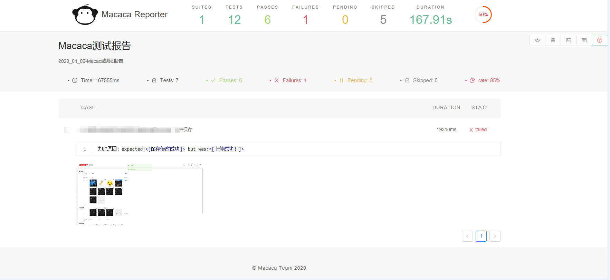

# Macaca Reporter Plugin For Java

[](https://travis-ci.org/seata/seata)

## 使用方法

  以maven插件的形式进行开发，你只需要在pom文件中引入该插件即可，并使用mvn去执行测试即可。
  
```xml
        <dependency>
            <groupId>com.macacajs</groupId>
            <artifactId>macaca-reporter-java-plugin</artifactId>
            <version>1.0-SNAPSHOT</version>
        </dependency>
```

[中文文档](docs/guide.md)

## 依赖于junit5的实现
 
  #### 实现原理
  junit5定制了API方法TestExecutionListener，实现此方法可监听测试过程，在工程目录/resources中文件中添加/META-INF/services/org.junit.platform.launcher.TestExecutionListener将自动加载和注册。
  
  测试计划运行过程中，我们通过TestExecutionListener接口抓取我们需要的数据，根据macaca-report所需要的json数据，组合出对应的json串。
  
  计划运行完毕，通过`macaca-reporter -d 'test/fixtures/final` 生成报告的功能，产出对应的macaca测试报告。
  

## 测试报告和json的保存位置

  json会保存到当前工程目录的`report.js`文件。
  报告文件也会即时生成保存到当前工程目录的 `./reports/index.html` 。 
  测试运行完成，你只需要查看`./reports/index.html`即可。
  
## 功能

#### 关于截图：

测试运行过程中用例如果执行失败，会在当前工程目录下的 `./screenshot`文件中进行抓取，根据`junit5`的`DisplayName`特性，获取文件名称并检查是否有包含该条测试的截图，将其转换为Base64图片编码，保存到json数据中。
所以建议保存截图使用`DisplayName`的方式命名，否则可能获取不到截图。

如：

```java
    @Override
    public void testFailed(ExtensionContext context, Throwable cause) {
        saveScreen(context.getDisplayName()+"_"+new SimpleDateFormat("yyyy_MM_dd_HH_mm_ss").format(new Date()));
    }
```

#### 关于测试面板

我们引入了Macaca Current 的特性，你可以通过mvn命令指定增加项目logo图片。
引入之后会在首页显示出Current Screen 、 Current status两项，你也可以忽略这项功能。

```
mvn test -Dlogo=https://macacajs.github.io/macaca-logo/svg/monkey.svg
```

具体效果可以参考测试类： MacacaTestExecutionListenerTest生成的测试结果。

#### 关于测试计划名称

同测试面板，可以使用mvn进行配置 ，默认名称“Macaca测试报告”
```
mvn test -DplanName=这是一个测试计划名称
```

## 基于gitLab CI自动执行

我们增加了gitLab CI的配置模板，可供参考 详见 gitlab-ci.yml

## Contributors
|[<br/><sub><b>houseshi</b></sub>](https://github.com/houseshi)<br/>|[<br/><sub><b>niaoshuai</b></sub>](https://github.com/niaoshuai)<br/>|
| :---: | :---: | 

<!-- GITCONTRIBUTOR_END -->

## Sample
（图1）


（图2）


（图3）


## License

The MIT License (MIT)
