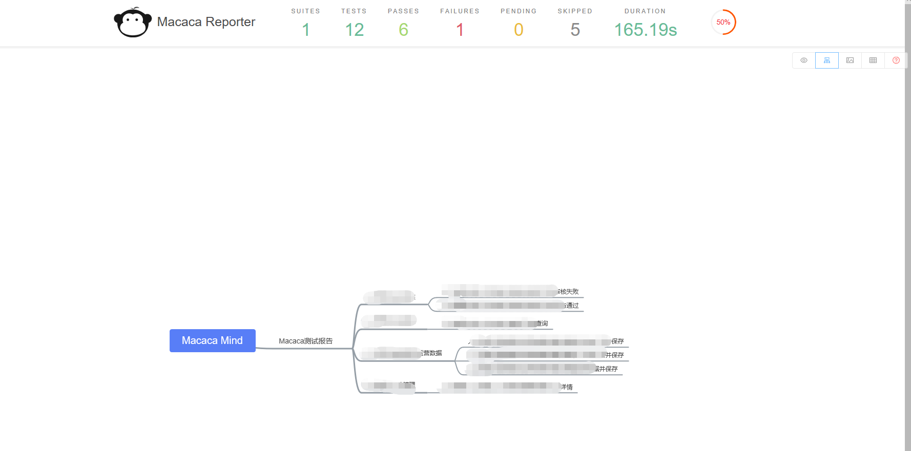
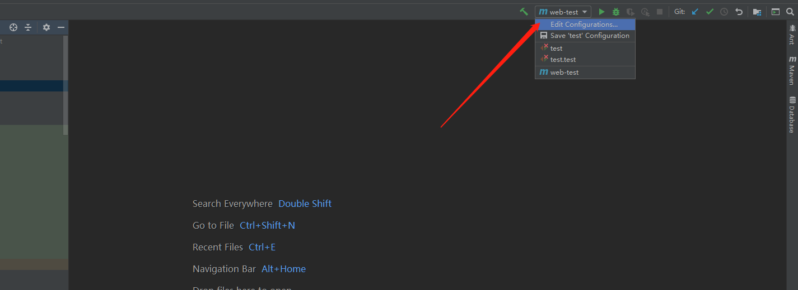
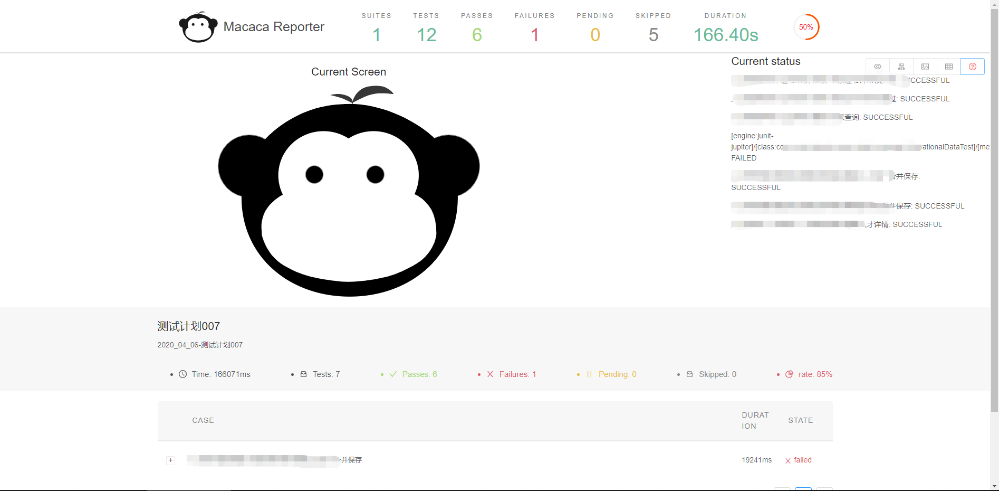

# macaca-reporter-java-plugin （基于java-junit5的macaca测试报告）

目前mcaca-reporter对java的测试代码没有很好的支持，公司目前的自动化一直使用macaca配合java和junit5进行，在这基础上，
为支持开源，对macaca-reporter进行了一些研究，试图在java的基础上开发出一个适用于java的macaca测试报告。

目前我们产出了第一个版本，也就是当前的`macaca-reporter-java-plugin`。报告效果如下：

（图1，据说适当打码有益身心健康）


（图2）


（图3）


## 如何使用macaca-reporter-java 

因为我们目前是基于junit5进行开发，所以第一步你可能要在你的测试代码中引入junit5

## pom.xml 引入 junit5
```xml
<dependency>
    <groupId>org.junit.platform</groupId>
    <artifactId>junit-platform-launcher</artifactId>
    <version>1.6.0</version>
    <scope>test</scope>
</dependency>
<dependency>
    <groupId>org.junit.jupiter</groupId>
    <artifactId>junit-jupiter-engine</artifactId>
    <version>5.6.0</version>
    <scope>test</scope>
</dependency>
<dependency>
    <groupId>org.junit.vintage</groupId>
    <artifactId>junit-vintage-engine</artifactId>
    <version>5.6.0</version>
    <scope>test</scope>
</dependency>

```

虽然引入了junit5，但是你可能还是需要保留你现有的junit4，依赖于junit4中的Assert进行断言。

```xml
        <dependency>
            <groupId>junit</groupId>
            <artifactId>junit</artifactId>
            <version>4.12</version>
            <scope>compile</scope>
        </dependency>
```

## 引入macaca-reporter-java-plugin

```xml
        <dependency>
            <groupId>com.macacajs</groupId>
            <artifactId>macaca-reporter-java-plugin</artifactId>
            <version>1.0-SNAPSHOT</version>
        </dependency>
```

如果你已经使用了junit5完成了你的测试代码，不妨直接运行瞧一瞧试一下结果。

如果你需要使用junit5开始改造你的代码，你可能需要了解下junit5。

[junit5官方文档](https://junit.org/junit5/docs/current/user-guide/#overview-java-versions)

macaca-reporter-java-plugin实现原理源于官方文档的[6.1.5章节](https://junit.org/junit5/docs/current/user-guide/#launcher-api-listeners-custom)

## 一些功能特性

#### 获取截图

建议使用junit5的`@DisplayName`特性，你可以通过给用例添加该注解配置用例对应的标题，在用例失败的时候使用getDisplayName方法去命名错误图片。

用例如果失败，macaca-reporter-java-plugin将通过当前工程的目录`./screenshot`下去获取图片名，并通过DisplayName去比对，找到对应的图片转换为Base64图片码保存到报告中。

###### junit5监听用例状态，并截图参考方法：

```java

@ExtendWith(BaseTest.class)
public class BaseTest  implements TestWatcher {
      @BeforeAll
      static void beforeAll() { ... }
      @BeforeEach
      void setUp() { ... }
      @Test
      void name() { ... }
      @AfterEach
      void tearDown() { ... }
      @AfterAll
      static void afterAll() { ... }
      @Override
      public void testFailed(ExtensionContext context, Throwable cause) {
         //截图方法。
         saveScreen(context.getDisplayName()+"_"+new SimpleDateFormat("yyyy_MM_dd_HH_mm_ss").format(new Date()));
      }          
}
```

#### 指定计划名
mvn执行配置增加
```maven
  -DplanName=测试计划报告
```

#### 指定Current Screen图
mvn执行配置增加
```maven
  -Dlogo=http://www.logo.png
```

#### 测试报告生成位置

测试执行完毕，你会在当前工程目录中发现多出一个`report.js`文件，和一个`/reports`目录。

report.js 查看你会发现这里边储存的就是macaca-reporter所需要的json数据， 你也可以尝试修改report.js中json的数据，然后在当前目录执行 `macaca-reporter -d report.js `命令然后检查测试报告的变化。 

/reports目录下自动生成的 index.hlml ,就是我们的测试报告了，你可以使用浏览器直接打开查看。


## 如何执行测试

因为macaca-reporter-java-plugin是以maven插件的形式开发，所以需要通过mvn去执行测试，建议通过idea增加Mavne执行配置去便捷执行。

mvn执行配置参考

（添加入口）



（参考）


####  根据上图配置的运行结果




## 开源仓库

[macaca-reporter-java-plugin](https://github.com/niaoshuai/macaca-reporter-java-plugin)

## 问题&建议

如果你在使用过程中出现了什么问题，或者有好的建议可以在仓库中以issue的方式反馈给我们，
或者在Macaca开源社区钉钉群中可以联系到我们  钉钉群号（11775486）@鸟帅 @石 星
