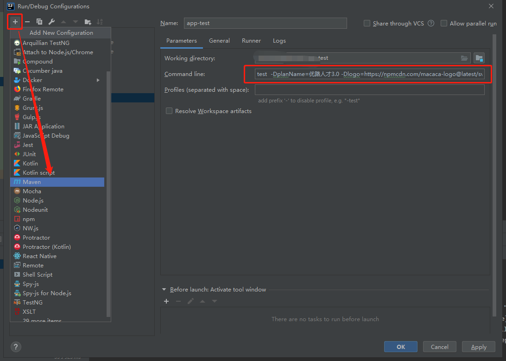

# macaca-reporter-java-plugin [基于java-junit5的macaca测试报告]

---

报告效果如下：


## 如何使用 macaca-reporter-java-plugin 

因为我们目前是基于junit5进行开发，所以第一步你可能要在你的测试代码中引入 junit5

## 1. pom.xml 引入 junit5

```xml
<dependency>
    <groupId>org.junit.jupiter</groupId>
    <artifactId>junit-jupiter-api</artifactId>
    <version>5.6.0</version>
    <scope>test</scope>
</dependency>
<dependency>
    <groupId>org.junit.jupiter</groupId>
    <artifactId>junit-jupiter-params</artifactId>
    <version>5.6.0</version>
    <scope>test</scope>
</dependency>
<dependency>
    <groupId>org.junit.jupiter</groupId>
    <artifactId>junit-jupiter-engine</artifactId>
    <version>5.6.0</version>
    <scope>test</scope>
</dependency>
```

## 2. 引入macaca-reporter-java-plugin

```xml
<dependency>
    <groupId>com.macacajs</groupId>
    <artifactId>macaca-reporter-java-plugin</artifactId>
    <version>1.0</version>
</dependency>
```

如果你已经使用了 junit5 完成了你的测试代码，不妨直接运行尝试一下结果。如果你需要使用junit5开始改造你的代码，你可能需要了解下junit5。

[junit5官方文档](https://junit.org/junit5/docs/current/user-guide/#overview-java-versions)

macaca-reporter-java-plugin实现原理源于官方文档的[6.1.5章节](https://junit.org/junit5/docs/current/user-guide/#launcher-api-listeners-custom)

## 3. 开始改造你的代码

### 监听用例状态并给错误截图

建议使用junit5的`@DisplayName`特性，你可以通过给用例添加该注解配置用例对应的标题，在用例失败的时候使用getDisplayName方法去命名错误图片。

用例如果失败，macaca-reporter-java-plugin将通过当前工程的目录`./screenshot`下去获取图片名，并通过DisplayName去比对，找到对应的图片转换为Base64图片码保存到报告中。

#### junit5监听用例状态，并截图参考方法：

```java
@ExtendWith(BaseTest.class)
public class BaseTest  implements TestWatcher {
      @BeforeAll
      static void beforeAll() { ... }
      @BeforeEach
      void setUp() { ... }
      @Test
      @DisplayName("失败的用例")
      void name() { ... }
      @AfterEach
      void tearDown() { ... }
      @AfterAll
      static void afterAll() { ... }
      @Override
      public void testFailed(ExtensionContext context, Throwable cause) {
         //截图方法。
         saveScreen(context.getDisplayName()+"_"+new SimpleDateFormat("yyyy_MM_dd_HH_mm_ss").format(new Date()));
      }
}
```

## 4. 执行测试

因为 macaca-reporter-java-plugin 是以 maven 插件的形式开发，建议通过 IDE 增加 Maven 执行配置去便捷执行。

### 指定计划名

mvn执行配置增加 （默认名：Macaca测试报告）

```bash
$ -DplanName=测试计划报告
```

### 指定Current Screen图

mvn执行配置增加 （不需要可忽略）

```bash
$ -Dlogo=http://www.logo.png
```

mvn执行配置参考





### 测试报告生成位置

测试执行完毕，你会在当前工程目录中发现多出一个 `report.js` 文件，和一个 `/reports` 目录。

report.js查看你会发现这里边储存的就是macaca-reporter所需要的 json 数据， 你也可以尝试修改report.js中json的数据，然后在当前目录执行 `macaca-reporter -d report.js `命令然后检查测试报告的变化。 

/reports目录下自动生成的 index.html ,就是我们的测试报告了，你可以使用浏览器直接打开查看。

## 5. 运行结果（根据上图配置）


## 问题&建议

如果你在使用过程中出现了什么问题，或者有好的建议可以在仓库中以 issue 的方式反馈给我们，或者在Macaca开源社区钉钉群中可以联系到我们。
